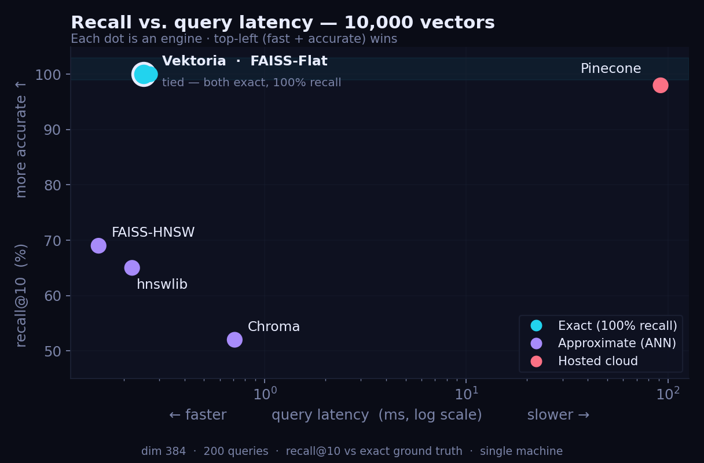
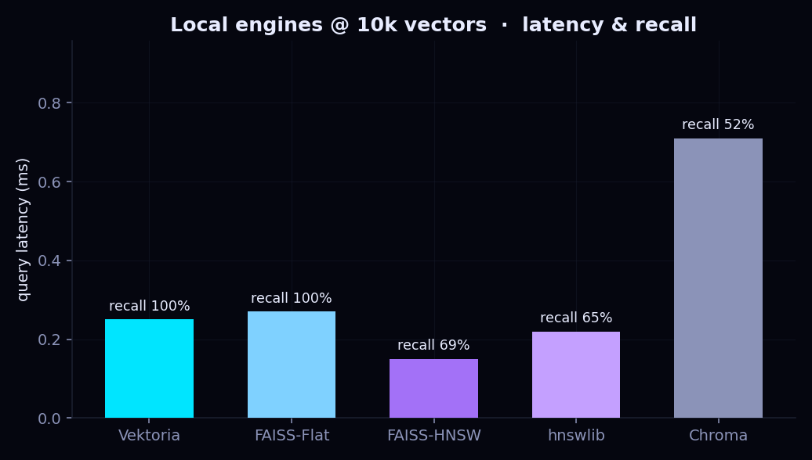
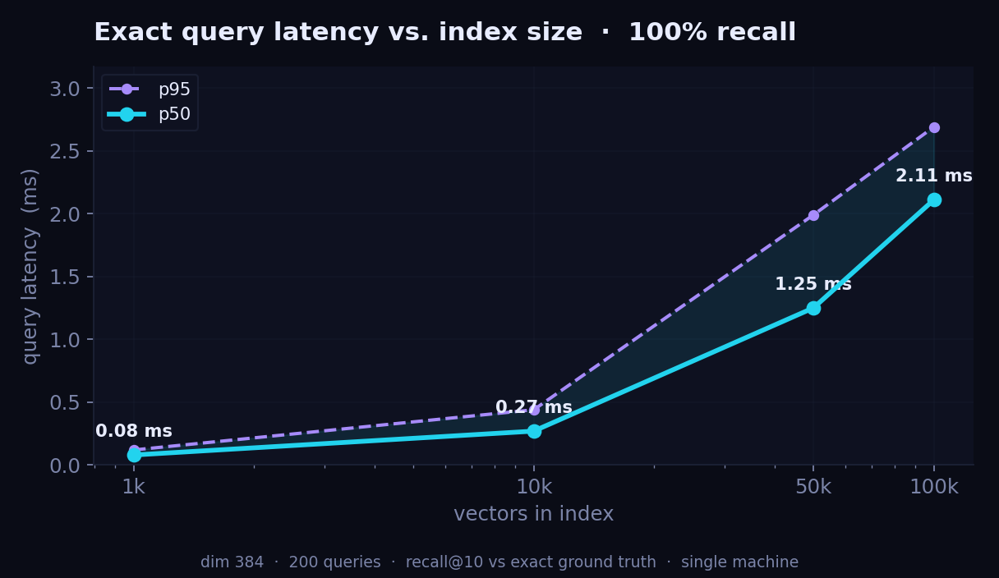

<div align="center">

# ⬢ Vektoria

**The sovereign European vector database.**

Exact vector search in **~2 ms at 100k vectors** (100% recall), hybrid keyword + semantic ranking, and **PDF-to-search built in** — running entirely on your own server. Not a single byte ever leaves your machine.

[](LICENSE)
[](https://github.com/hillzeealex/vektoria)
[](https://www.python.org/)
[](#roadmap)
[](#sovereignty--gdpr)

</div>

---

Building RAG or semantic search where **data sovereignty and GDPR matter**? You're in the right place. Vektoria is an open-source vector database you host yourself — on a Swiss, French, or German VPS — so legal, medical, financial, or strategic documents never transit a US cloud subject to the [CLOUD Act](https://en.wikipedia.org/wiki/CLOUD_Act).

## Quickstart

```bash
pip install 'vektoria[ingest,embeddings-onnx]'
```

**Send a PDF, search it in natural language** — extraction, chunking and embedding happen on your machine:

```python
from vektoria import IndexManager
from vektoria.embedding import FastEmbedEmbedder
from vektoria.ingest import Ingestor

emb = FastEmbedEmbedder("sentence-transformers/paraphrase-multilingual-MiniLM-L12-v2")
mgr = IndexManager("./data")
mgr.create_index("contracts", dimension=emb.dimension)
index = mgr.get("contracts")

# extract → chunk → embed → store, all local
Ingestor(emb).ingest(open("contrat.pdf", "rb").read(), "contrat.pdf", index)

for hit in index.query(emb.embed_query("clause de résiliation"), top_k=3):
    print(f"{hit.score:.2f}  {hit.metadata['text'][:80]}")
```

**Or bring your own vectors** — vector, keyword (BM25), and hybrid search, metadata filters, and GDPR primitives:

```python
index.upsert([
    {"id": "c1", "values": my_vector, "metadata": {"text": "...", "source": "contrat.pdf"}},
])

# pure vector search
index.query(query_vec, top_k=5)

# hybrid: blend semantic vectors with BM25 keywords
index.query(query_vec, top_k=5, hybrid=True, alpha=0.5, text="résiliation")

# metadata filter
index.query(query_vec, top_k=5, filter={"source": "contrat.pdf"})

# GDPR: real erasure + full export
index.delete(filter={"source": "contrat.pdf"})
dump = index.export()
```

## REST API

A clean HTTP layer, for any language:

```bash
pip install 'vektoria[server]'
vektoria serve --host 0.0.0.0 --port 8000      # optional auth: VK_API_KEY=… vektoria serve
```

```bash
# create an index
curl -X POST localhost:8000/v1/indexes -d '{"name":"docs","dimension":384}'

# ingest a document (server-side extract → chunk → embed)
curl -X POST localhost:8000/v1/indexes/docs/ingest -F "file=@contrat.pdf"

# search in natural language (server embeds the query)
curl -X POST localhost:8000/v1/indexes/docs/query -d '{"text":"clause de résiliation","top_k":3}'
```

Endpoints: `POST/GET/DELETE /v1/indexes`, `…/upsert`, `…/query`, `…/ingest`, `…/delete`, `…/export`, `GET /health`. Auth is an optional Bearer key; CORS origins are explicit (never `*`).

There's also a **read-only dashboard** at `GET /dashboard` — browse your indexes and run a search playground. Keep it private by binding to localhost and reaching it through an SSH tunnel:

```bash
ssh -L 8000:localhost:8000 user@your-vps   # then open http://localhost:8000/dashboard
```

## Benchmarks

> Reproducible on your own machine — same vectors, same queries, recall@10 vs **exact** ground truth.
> Run `python benchmarks/bench_vs.py` then `python benchmarks/plot.py`.

### Recall vs. latency

<div align="center">

</div>

Vektoria's search is **exact** — 100% recall, no tuning — and **ties FAISS-Flat** (Meta's C++) at ~0.26 ms: a pure-Python/numpy core matching the reference. The approximate engines (FAISS-HNSW, hnswlib, Chroma) shave microseconds but drop recall — low here because *random* vectors are a worst case for ANN; on real embeddings recall is much higher. A hosted cloud service pays a network round-trip on every query (the rightmost point, ~92 ms); **self-hosting removes it entirely**.

| engine | p50 latency | recall@10 | |
|---|---:|---:|---|
| **Vektoria** (exact) | **0.25 ms** | **100%** | self-hosted |
| FAISS-Flat (exact) | 0.27 ms | 100% | Meta, C++ |
| FAISS-HNSW (approx) | 0.15 ms | 69% | |
| hnswlib (approx) | 0.22 ms | 65% | |
| Chroma (approx) | 0.71 ms | 52% | |
| Pinecone (cloud) | 92 ms | 98% | incl. network |

<div align="center">

</div>

### Latency vs. index size

<div align="center">

</div>

Exact search is O(n): ~2 ms at 100k vectors, 100% recall, no network. Latency grows linearly — the honest cost of exactness. Past ~1M vectors an approximate backend ([TurboVec](https://github.com/RyanCodrai/turbovec), Rust) would flatten the curve; until then, brute-force is simpler and fast enough.

| vectors | query p50 | query p95 | RAM |
|--------:|----------:|----------:|----:|
| 1,000   | 0.08 ms   | 0.12 ms   | 2 MB |
| 10,000  | 0.27 ms   | 0.44 ms   | 15 MB |
| 50,000  | 1.25 ms   | 1.99 ms   | 77 MB |
| 100,000 | 2.11 ms   | 2.69 ms   | 154 MB |

## How it works

Each index is **a single SQLite database**. Vectors are L2-normalized on write and stored as `float32` blobs next to their JSON metadata, so the database is the one source of truth — no separate files to desync or corrupt.

On open, Vektoria builds an in-memory numpy matrix, an id list, and a BM25 keyword index from that database. A query is **exact brute-force cosine** — a single matrix-vector product — optionally blended with BM25 for hybrid ranking, then filtered on metadata. Writes update the in-memory mirror **incrementally** (no full reload), and every operation is guarded by a per-index lock, so it is safe under the REST server's thread pool. Deletes really remove rows (GDPR erasure) and `export` dumps the whole index (portability).

The core engine depends only on **numpy** — embedding models, PDF parsing, and the web server are opt-in extras, so the base install stays tiny.

```
document (PDF/DOCX/…)  ─or─  raw vectors
            │
   extract → chunk → embed            (local, optional)
            │
   IndexManager  ·  LRU cache of open indexes
            │
   per-index SQLite (float32 blobs + metadata)
            │
   exact cosine  +  BM25  +  hybrid  +  filters
```

## Self-host on your VPS

**1. Get a VPS in Europe / Switzerland.** Any provider works — Infomaniak or Exoscale (🇨🇭), OVHcloud or Scaleway (🇪🇺). Minimum ~4 GB RAM; 8–16 GB if you embed documents server-side.

**2. Install & run.**
```bash
ssh user@your-vps
sudo apt update && sudo apt install -y python3.11 python3.11-venv git
git clone https://github.com/hillzeealex/vektoria.git && cd vektoria
python3.11 -m venv .venv && source .venv/bin/activate
pip install -e '.[all]'
VK_DATA_DIR=/var/lib/vektoria VK_API_KEY=$(openssl rand -hex 16) vektoria serve --host 0.0.0.0
```

**3. Harden it (GDPR / art. 32).**
- Enable **full-disk encryption (LUKS)** on the VPS for data at rest, and put TLS (e.g. Caddy) in front.
- Set `VK_API_KEY` for any non-localhost exposure; keep the data directory on the box only.

**Or one command with Docker:**
```bash
docker compose up -d      # builds the image, runs the API on 127.0.0.1:8000
```
The image ships the server, PDF ingestion, and a torch-free (ONNX) embedder, runs as a non-root user, and persists data in a named volume. Edit `docker-compose.yml` to set `VK_API_KEY` and expose it behind TLS for public access.

## Sovereignty & GDPR

Switzerland has its own data-protection law (nLPD/revFADP), benefits from an EU adequacy decision, and is **not subject to the US CLOUD Act** — for many European customers an even stronger guarantee than hosting inside the EU. Self-hosting Vektoria takes it further: there is **no processor in the loop at all**. You are the sole controller of your data, and the engine ships GDPR primitives — real deletion (right to erasure) and full export (portability) — as first-class operations.

## Roadmap

- [x] **Core engine** — multi-index storage, cosine + BM25 + hybrid search, metadata filters, real delete, export, LRU cache, thread-safe
- [x] **REST API** — clean `/v1/indexes` endpoints, optional API-key auth, scoped CORS
- [x] **Document ingestion** — PDF/DOCX/TXT/MD/HTML/CSV → vectors, server-side, with text-query embedding
- [x] **pip install** — `pip install vektoria` (extras: `[server]`, `[embeddings]`, `[embeddings-onnx]`, `[ingest]`, `[all]`) + `vektoria serve`
- [x] **Dashboard** — read-only console + search playground at `/dashboard`
- [x] **Docker** — `docker compose up -d`, torch-free image, non-root, persistent volume
- [ ] **Scale backend** — optional [TurboVec](https://github.com/RyanCodrai/turbovec) ANN engine for very large indexes

## License

[MIT](LICENSE) — free to use, modify, and self-host.

<div align="center">
<sub>Built for teams who keep their data on their own side of the Atlantic.</sub>
</div>
